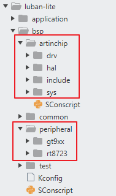

# 1. 代码存放位置

在Luban-Lite中，将Driver、HAL、sys（最小系统）代码统称为bsp，存放在SDK跟目录中的`bsp`文件夹中。

在bsp文件夹中，再按照SoC内置 和 外挂 分为两个文件夹：`artinchip` 和`peripheral`

# 2. 编译框架修改

`SConscript` 文件的修改和编写。

# 3. 编码规范

## 3.1 编码风格

编码风格以RT-Thread的原生规范为准，参考文件：

`kernel/rt-thread/documentation/contribution_guide/**coding_style_cn.md`

## 3.2 驱动分层的设计规范

对于每一个模块的驱动，按照  Driver + HAL 两层来设计：

- Driver层：**连接HAL和Driver Framework的桥梁**，主要是将Driver Framework的各功能接口转换成HAL层的操作组合。
- HAL层：完全屏蔽直接访问 **寄存器层面的操作**，将寄存器操作封装为一个个单独的功能点（HAL可理解为一个执行器）。
- 一个简单的区分方法：所有寄存器级别的访问，都放在HAL层去封装。也就是说，Driver层不应该出现直接读写寄存器。
- 理想情况：**如果要换OS，就只需要换Driver；如果要换硬件，就只需要换HAL。**

当然，个别驱动比如syscfg模块的逻辑很简单，不需要模块初始化，也可以不需要Driver层，只实现HAL层即可。

## 3.3 命名规则

**文件名的命名**：

- 全部用 `小写字母 + 下划线"_"` 组成，如 hal_rtc.h
- 放在 bsp/artinchip/ 目录下都属于ArtInChip开发的代码，除common的文件如aic_log.h，其他各模块的**文件名不需再加公司名称的前缀**
- Driver层的文件名格式：`“drv_” + 模块名 + “_子功能”（如果需要的话）`，如 drv_rtc.c
- HAL层的文件名格式：`“hal_” + 模块名 + “_子功能”（如果需要的话）`，如 hal_rtc.c

**接口的命名**：

- 这里只约束对外的接口，内部使用接口全部用static修饰 ，避免命名冲突即可
- Driver层的对外接口命名格式： `“drv_” + 模块名 + “_子功能”（如果需要的话）`，如drv_rtc_init()
- HAL层的对外接口命名格式： `“hal_” + 模块名 + “_子功能”（如果需要的话）`，如hal_rtc_init()

**数据结构的命名**：

一个模块分成Driver和HAL层后，可能需要不同层次的数据结构来存放相应的信息，这个数据结构的名称最好大家也统一风格。

- Driver层的数据结构名称格式：`aic_模块缩写` 或者 `aic_模块缩写_dev` ，如aic_i2c、aic_sdmc、aic_wdt_dev
- HAL层的数据结构名称格式：`aic_模块名称_host` 或者 `aic_模块名称_ctrl` ，如 aic_sdmc_host