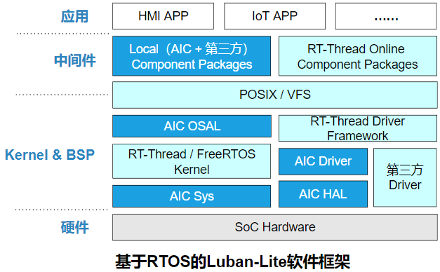
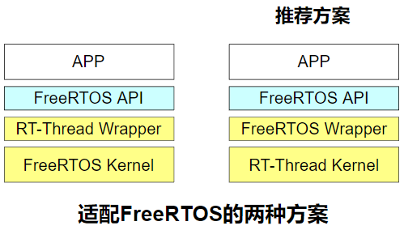
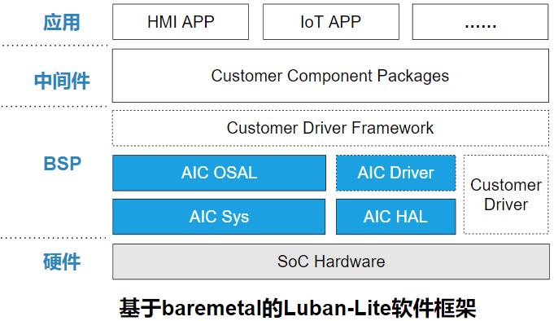
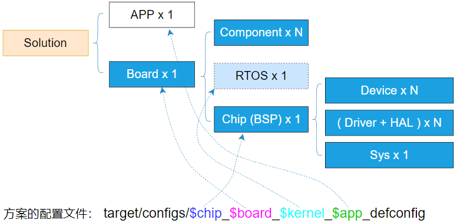
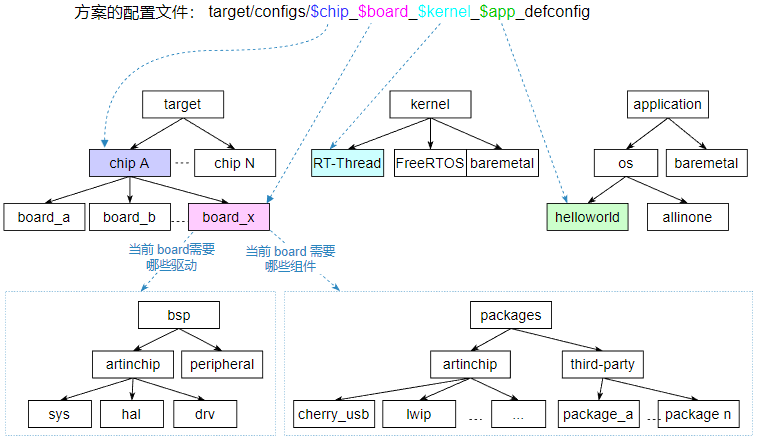
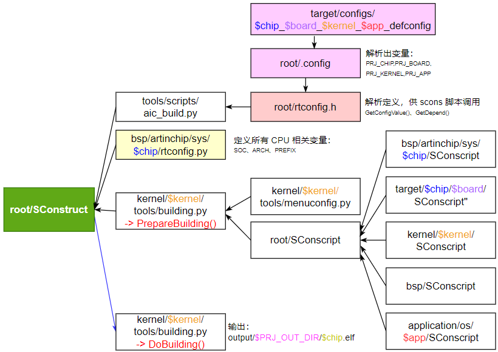
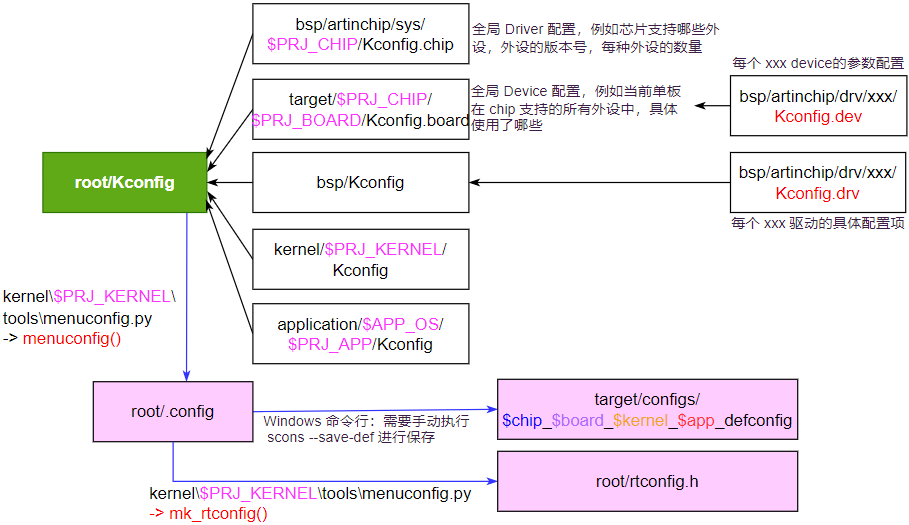
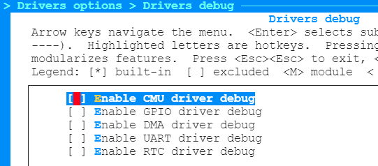
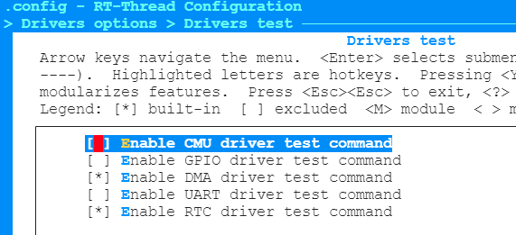

# 1. Luban-Lite简介

Luban-Lite SDK 的设计目标：

- 兼容目前市面上最流行的几种 RTOS 内核：RT-Thread、FreeRTOS等
- 支持baremetal模式
- 提供完整的软件栈生态资源

为了满足上述目标，Luban-Lite 在原有的 RT-Thread SDK 框架基础之上进行二次开发和扩展：

- 对于内核部分，做成 RT-Thread、FreeRTOS、baremetal 无感切换
- 尽可能复用 RT-Thread的 驱动框架和组件生态

## 1.1 Luban-Lite 框架

根据是否使用OS，Luban-Lite SDK 架构分为两种情况：

- 使用RTOS的情况：



其中，对FreeRTOS的适配，存在两种方案（对APP层都是透明的）：



- 使用baremetal的情况：（虚线外框表示可能不存在）



## 1.2 目录结构

Luban-Lite SDK的目录结构如下：

```
luban-lite $ tree -L 2
├── application     // 存放APP代码
│   ├── baremetal
│   └── os
├── bsp // 存放BSP代码，和RT-Thread原生的bsp目录功能相同
│   ├── artinchip // ArtInChip SoC内部的driver、hal以及最小系统sys代码
│   ├── common 
│   └── test // 各驱动的测试代码
├── doc // Luban-Lite SDK的介绍文档
│   ├── luban-lite_driver_development_guid.md  // 设备驱动开发指南
│   ├── luban-lite_sdk_design.md // SDK设计说明
│   ├── luban-lite_user_guid_linux.md // Linux环境的用户使用说明 
│   └── luban-lite_user_guid_windows.md // Windows环境的用户使用说明
├── win_env.bat // 启动RT-Thread的env工具，用于Windows环境的开发
├── win_cmd.bat // 启动CMD.exe，用于Windows环境的开发
├── kernel // 存放各种RTOS内核
│   ├── common
│   ├── freertos
│   └── rt-thread
├── output // SDK的编译输出
├── packages // 组件包
│   ├── artinchip // ArtInChip开发的组件包
│   └── third-party // 第三方的组件包
├── target // 方案（板）级的代码和配置
│   ├── configs // 整个方案的SDK配置文件
│   └── d21x // d21x 芯片对应的板级代码（见子目录）
│      ├── demo100-nand
│      ├── per2-nand
│      └── per2-nor
├── toolchain // 解压后的工具链存放目录
└── tools // 一些工具
    ├── onestep.sh  // ArtInChip开发的OneStep命令行增强工具
    └── toolchain // 工具链的压缩包
```

# 2. Luban-Lite 设计说明

## 2.1 四级抽象模型

对于一个跨（软/硬件）平台的SDK 来说，需要支持：

- 多个SoC芯片，需要做好驱动和设备的分离、驱动实例化等
- 多块单板，每块板子的外设、IO、性能配置各不相同
- 多种应用，1块板子可能支持多个应用
- 若干组件，驱动、组件、应用的对应存在一对多的依赖

总体上，以上元素形成了  `N x N x N` 的多对多组合关系。

在满足以上复杂映射关系的基础上，SDK 设计还需要达到：

- 用高内聚提供复用：减少代码冗余，减少维护工作量
- 用低耦合应对变化：针对某个方案又能灵活配置，满足客户的多元化使用

为了解决上述需求，Luban-Lite SDK框架中抽象出四个层级的元素：



在具体的 Luban-Lite 设计中，从用户角度看，以上四级基本元素和SDK目录的对应关系如下图：




## 2.2 编译框架

Luban-Lite SDK 采用了 `scons` 作为编译框架的基础语言，相对传统的 `Makefile`会更灵活更强大。

 `scons` 是基于 python 语言的，除了编译语法远胜于语法难记功能弱小的 `Makefile` 语法，它还有无限的扩展性可以把任意操作扩展成和编译命令并列的命令，方便用户使用。另外 `Cmake` 的编译配置也是非常方便远优于 `Makefile`，但是 `Cmake` 扩展性也是远不及 `scons` 的。

关于 `scons` 请参考非常经典的官方文档 [scons-user-guid](https://www.scons.org/doc/production/HTML/scons-user.html) 和 [scons-man-page](https://www.scons.org/doc/production/HTML/scons-man.html) 。

Luban-Lite 编译框架使用了以下树形结构进行层次化的引用：



有了 `scons` 框架的加持，Luban-Lite SDK 非常方便的支持 3 种场景的编译：

- Linux 命令行
- Windows 命令行，含CMD、Git-bash、RT-Thread env环境
- Windows IDE

## 2.3 Menuconfig 配置框架

Luban-Lite SDK 采用了 Menuconfig 工具来进行配置，提升用户修改配置的易用性和简洁性。

Luban-Lite Menuconfig 配置框架使用了以下树形结构进行层次化的引用：



值得特别说明的一个概念是在 Linux Kernel 下用户配置是分成两部分来保存的，它的设计思想：

- `.config` 文件保存 `Driver` 配置信息
- `dts` 文件保存 `Device` 配置信息。

在 Luban-Lite 下，我们使用一个 `.config` 文件同时保存 `Driver` 和 `Device` 配置信息，没有 DTS 配置方式。

为了更好的管理这些配置信息，对于单个模块来说，我们把 `Kconfig` 细分成两个：

-  `Kconfig.dev`，存放Device相关的配置参数，比如UART模块的波特率、停止位参数
-  `Kconfig.drv`，存放Driver的通用配置参数，比如UART模块的DMA开关

在命令行下，Luban-Lite SDK的Menuconfig 的配置方法：

```
$ cd luban-lite
$ scons --menuconfig                // Linux 命令行下启动 Menuconfig
$ ....                              // Menuconfig 配置过程
```

## 2.4 驱动框架

如本文开头所示，AIC Driver 需要支持多种形态下的复用。为了达到这个目的，整个驱动框架会分成 3 个层次：

- RT-Thread Driver Framework：由RT-Thread 提供的驱动模型，我们只需要实现驱动模型中现有的功能即可。
- AIC Driver Layer：对接RT-Thread Driver Framework的具体实现。
- AIC HAL Layer：对底层硬件操作的封装，一般是寄存器级别的功能接口。也用于baremetal模式的APP调用。

对于移植一个新的设备驱动来说，我们要开发Driver和HAL两层。

为了保证开发的驱动在多种形态下的复用，我们需要遵循以下的原则：

- 在 AIC Driver Layer 和 AIC HAL Layer 尽可能的使用 AIC OSAL 接口，避免直接调用具体 Kernel 接口。
- 为了保证可移植性，在 AIC Driver Layer 中除了驱动注册不可避免的需要调用 RT-Thread 接口，在其他地方避免直接调用 RT-Thread 系统接口和 RT-Thread 的相关类型定义。
- 对于中断注册和互斥锁、信号量的操作，尽可能放在 AIC Driver Layer 中，避免放在 AIC HAL Layer 中。

## 2.5 驱动调试

在menuconfig中，特意为ArtInChip的每个驱动都设置了一个DEBUG开关，用于打开相应模块的调试信息或者调试命令。

并且这些DEBUG开关统一放在一个地方，方便客户查找。在menuconfig中打开测试代码的配置方法：



## 2.6 驱动测试

在 `bsp/test/` 目录中，ArtInChip实现了一些驱动的测试代码，也可以作为Sample供客户的APP设计参考。

这些测试代码，一般是实现了一个shell命令，在系统启动后可以通过输入shell命令的方式来触发测试代码。

在menuconfig中打开测试代码的配置方法：



# 3. BSP 适配

## 3.1 编译选项

## 3.2 startup 启动

## 3.3 中断和异常

## 3.4 任务切换

## 3.5 libc 调用

## 3.6 内存管理

## 3.7 IO 访问

# 4. AIC OSAL 适配
