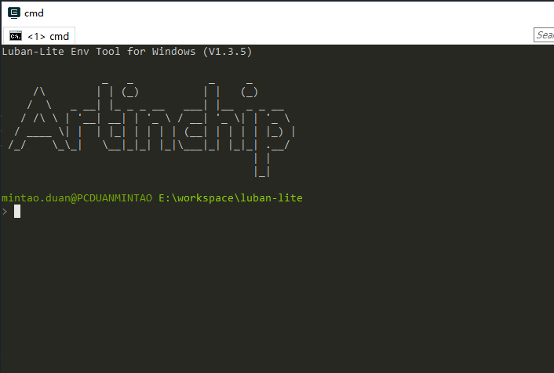
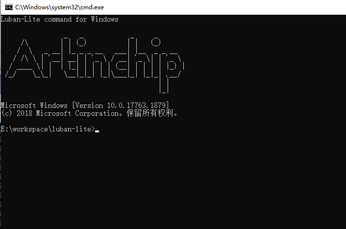
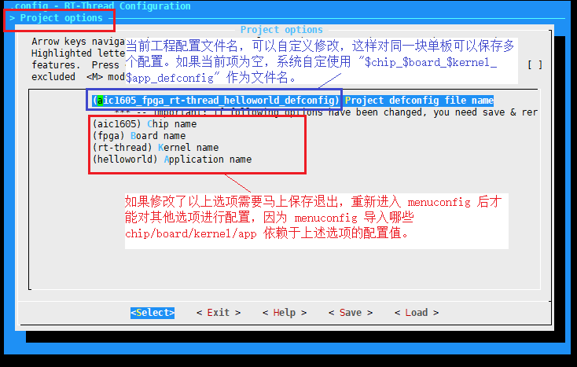
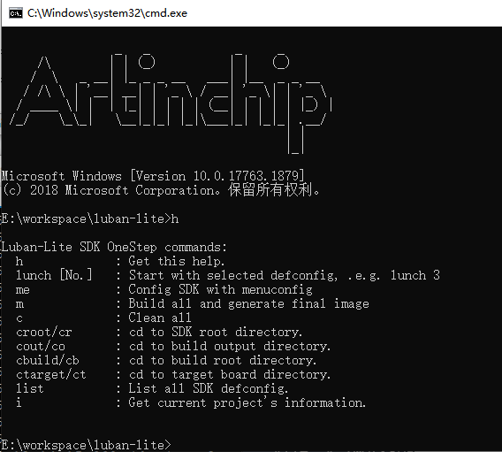
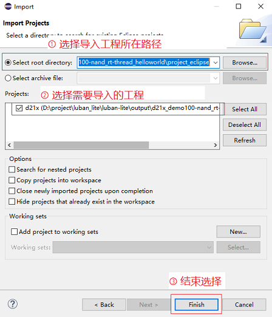
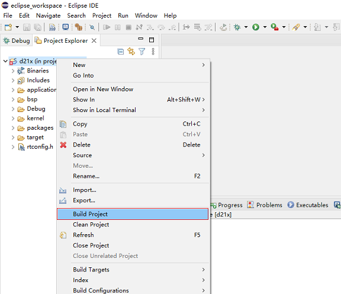
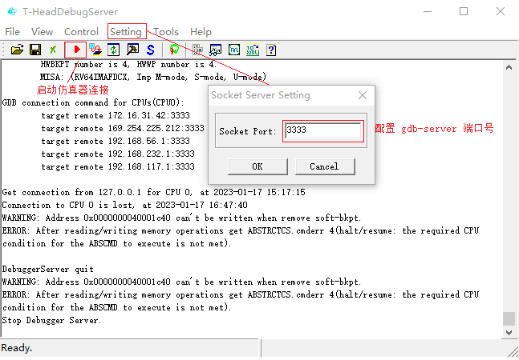
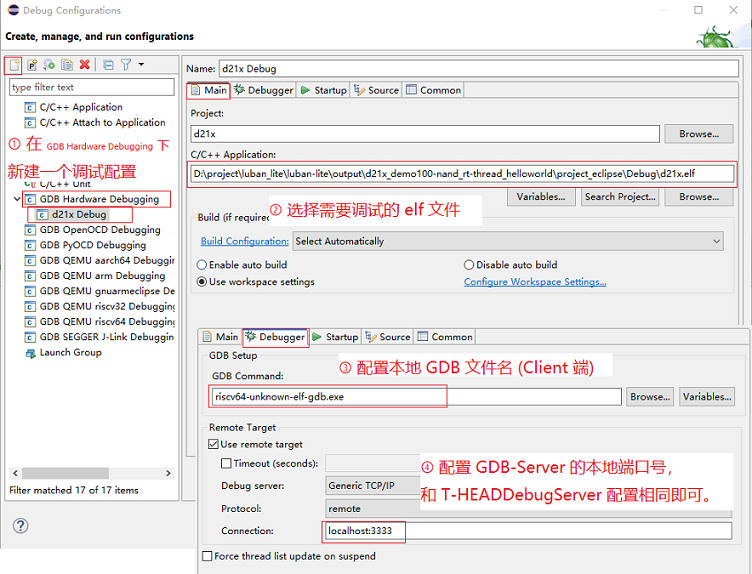

# 1. 环境安装

Luban-Lite SDK 采用了 `scons` 作为编译框架的基础语言，Windows 下的对应的各种工具已经存放在 `luban-lite/tools/env/tools` 目录当中，**不需要安装**。

# 2. 命令行使用方法

## 2.1 env 运行环境

直接双击 `luban-lite/win_env.bat` 打开专有的 Windows 的env命令行工具：



后面所有命令都在该命令行工具中进行操作。

## 2.2 CMD 运行环境

直接双击 `luban-lite/win_cmd.bat` 打开 Windows 的CMD命令行工具：



后面所有命令的使用和env相同。

## 2.3 工程加载

在编译一个工程之前，首先需要加载工程的现有配置：

```
$ cd luban-lite
$ scons --list-def                  // 列出当前所有的工程默认配置
$ scons --apply-def=xxx_defconfig   // 加载应用上述列表其中一条工程配置
```

和工程相关的命令还有：

```
$ scons --save-def                  // 手工保存当前工程配置  
$ scons --info                      // 列出当前工程的基本配置
```

## 2.4 Menuconfig 配置

在加载完工程配置后，可以使用 menuconfig 命令来修改当前配置：

```
$ cd luban-lite
$ scons --menuconfig                // Linux 命令行下启动 Menuconfig
$ ....                              // Menuconfig 配置过程
```

在修改 `Project options` 中的配置时需要注意以下要求：



## 2.5 编译

配置完成后，可以使用以下的命令进行编译：

```
$ cd luban-lite
$ scons                             // 编译当前工程，简洁输出
$ scons --verbose                   // 编译当前工程，详细输出
$ scons -c                          // 清理当前工程
$ ls output/$chip_$board_$kernel_$app/images/$soc.elf   // 编译生成的目标文件
```

## 2.6 其他命令

```
$ cd luban-lite
$ scons --run-qemu                  // 运行当前编译出来的qemu目标文件
$ scons --list-size                 // size 命令列出所有 .o 文件的 text/data/bss 各个 section 大小
$ scons --pkgs-update               // 下载选择的在线 packages
```

# 3. OneStep 增强命令

Luban-Lite 中对命令行中的scons工具进行了封装，将一些高频命令行操作定义了一组快捷命令，统称为OneStep命令。

OneStep命令的设计目标是：任意目录，只需一步。

在CMD、或者env窗口启动后，OneStep命令已经生效，在其中可以从任意目录执行以下命令，包括:

- lunch - 选择方案
- m - 编译SDK
- c - clean SDK
- cr - 跳转到SDK根目录等



# 4. Eclipse IDE

Luban-Lite 支持使用 Eclipse IDE 来进行调试，首先下载最新版本的 [Eclipse IDE for Embedded C/C++ Developers](https://www.eclipse.org/downloads/download.php?file=/technology/epp/downloads/release/2023-03/R/eclipse-embedcpp-2023-03-R-win32-x86_64.zip) 。

## 4.1 生成 Eclipse 工程

> 特别注意：首先确保工程已经在命令行环境下已经正确配置并且能成功编译以后，再使用下述命令一键生成工程对应的 Eclipse 工程文件。在工程配置发生改变以后，需要重新在命令行下编译成功后再重新生成 Eclipse 工程文件。

使用命令生成当前工程对应的 Eclipse 工程文件：

```
$ cd luban-lite
$ scons --target=eclipse            // 生成当前工程对应的 Eclipse 工程文件
```

生成的 Eclipse 工程文件存储在 `luban-lite/output/xxxx/project_eclipse` 目录：

```
$ ls -a output/d21x_demo100-nand_rt-thread_helloworld/project_eclipse
./  ../  .cproject  .project  .settings/
```

为了方便用户使用 Eclipse IDE 来添加自己的代码，还增加了一条命令来生成一个完整的 Eclipse SDK 软件包。该命令会把用户需要的所有源文件和库文件都独立的拷贝一份：

```
$ scons --target=eclipse_sdk        // 生成当前工程对应的 Eclipse SDK 工程
```

生成的 Eclipse 工程文件存储在 `luban-lite/output/xxxx/project_eclipse_sdk` 目录。因为所有需要的文件都已经拷贝，所以 `project_eclipse_sdk` 目录已经是一份独立的 SDK 了，可以拷贝到任何路径下进行调试。

## 4.2 导入 Eclipse 工程

打开下载的 `Eclipse IDE for Embedded C/C++ Developers`，通过菜单 `File -> Import -> Existing Projects into Workspace` 来导入上一步创建的 Eclipse 工程：



## 4.3 编译

在 `Project Explorer` 中选择成功导入的工程，在右键菜单中选择 `Build Project` 即可对整个工程进行编译。



编译生成的目标文件在 `luban-lite/output/xxxx/project_eclipse/Debug` 目录：

```
$ ll output/d21x_demo100-nand_rt-thread_helloworld/project_eclipse/Debug/
 d21x.bin
 d21x.elf                           // 调试需要的 elf 文件
 d21x.map
 d21x_demo100_nand_page_2k_block_128k_v1.0.0.img    // 烧录需要的 img 文件
 d21x_demo100_nand_page_4k_block_256k_v1.0.0.img
```

## 4.4 调试

Eclipse 通过 JTAG 调试器在线调试还需要以下关键组件：

-  `ddr_init.json`。修改该文件中的 jtag 值为 1。
-  `AiBurn`。烧录软件，把上述固件烧录到单板。
-  `CKLink`。JTAG 调试器。
-  `T-HeadDebugServer`。调试器在 PC 端的代理，以 GDB-Server 的形式提供调试服务。

Eclipse 在线调试的具体步骤如下：

- Step 1：编译 SDK ，生成镜像 img 文件。

- Step 2：安装 `AiBurn` 软件，使用 AiBurn 将 `ddr_init_only.img` 固件烧录到单板。烧录成功后，每次单板上电和复位后都会自动把 DDR 初始化好。

- Step 3：启动 `T-HEADDebugServer`，配置 GDB-Server 端口号：

    

- Step 4: Eclipse 中创建对应的 `Debug Configuration`。通过菜单 `Run -> Debug Configurations` 给编译成功的工程新建一个对应的调试配置：

    

经过上述配置以后，就可以方便的在 Eclipse 下进行在线调试了。

